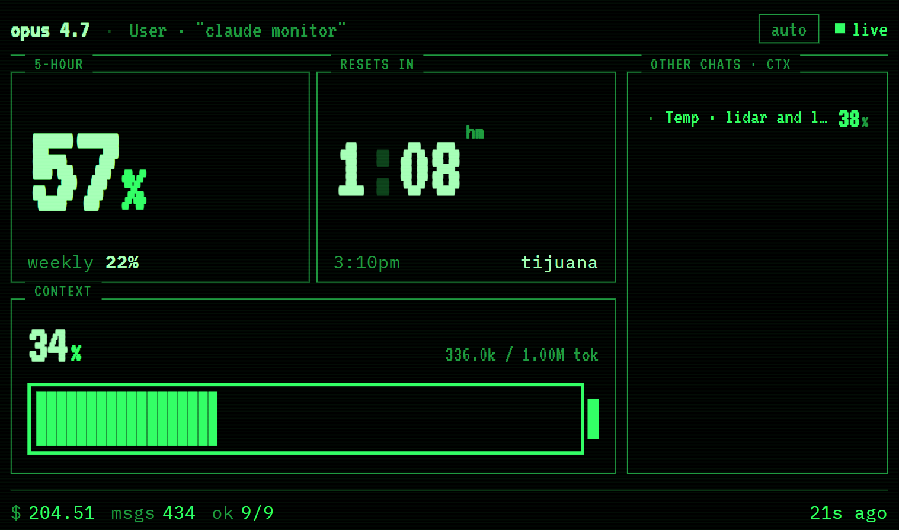
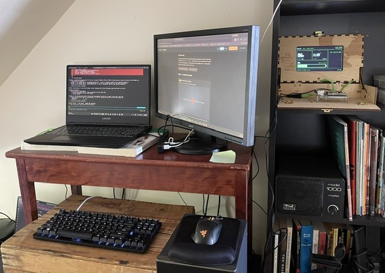
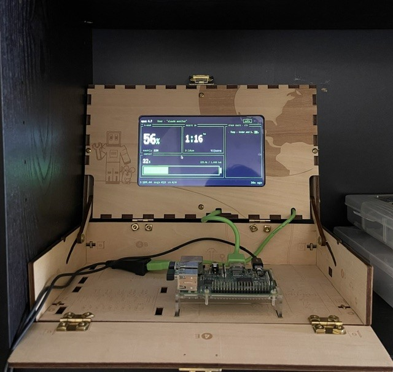

# claude-monitor

A wall-mounted 7" Raspberry Pi screen that shows **live Claude Code usage** —
exact `/usage` numbers (5-hour window %, weekly window %, reset countdowns),
current context %, session cost, and a tappable list of every Claude Code
session running on my desktop. Built because Anthropic doesn't expose any of
this through an API; it's computed inside the CLI and only ever rendered to
the terminal.



<p align="center">
  
  
</p>

---

## What's on the screen

The dashboard is sized for a fixed **800 × 480** pixel canvas and scales to fit
any viewport. Theme is "CRT terminal" — saturated green-on-black, VT323 +
IBM Plex Mono.

- **5-hour window %** — large foreground number, threshold-colored
- **Reset countdown** — `Hh : MM` with a blinking colon, ticks every second
- **Weekly window %** — inline secondary metric
- **Context battery** — battery-shaped indicator showing current session's
  `input + cache_creation + cache_read` against the model's context window
- **Other live sessions** — every Claude Code session whose transcript has
  been touched in the last 30 minutes, with its context %, tappable to focus
- **Footer** — session cost (computed from token counts × pricing), message
  count, scraper success rate (`38/40 ok`), "X seconds ago" last-update tick

If the `/usage` scraper has no data (cold-start, transient failure), the bars
render as `—` rather than approximate numbers, so what's on screen is *always*
either real or visibly absent.

---

## Architecture

```
┌─ Windows desktop ─────────────────────────────────┐
│                                                   │
│  Claude Code session(s)                           │
│      │                                            │
│      ▼ writes transcripts                         │
│  ~/.claude/projects/*.jsonl                       │
│      │                                            │
│      ▼ watched by                                 │
│  server.py (FastAPI + watchdog, port 8765)        │
│      │                                            │
│      ├─ TranscriptCache: parses JSONL             │
│      │                                            │
│      ├─ ScrapeState (every 90s):                  │
│      │    • spawns hidden claude.cmd via pywinpty │
│      │    • types `/usage`                        │
│      │    • parses dialog text → 5h%, weekly%, … │
│      │                                            │
│      └─ broadcasts state via WebSocket /ws        │
│                                                   │
└───────────────────────────────────────────────────┘
                       │
              HTTP/WebSocket on :8765
                       │
                       ▼
┌─ Raspberry Pi 3 + 7" screen ──────────────────────┐
│  Chromium kiosk → http://<desktop>:8765           │
│  Renders the dashboard fullscreen                 │
└───────────────────────────────────────────────────┘
```

The Pi has **zero code** — it's just a browser. All logic lives on the
desktop.

---

## The non-obvious bit: why scraping a TUI

`/usage` isn't an HTTP endpoint. It isn't logged to a file. Claude Code
computes it on demand from local state and renders the result to its terminal
UI. To get the exact number you'd see if you typed `/usage` yourself, you have
to actually drive the CLI.

`scrape_usage.py` does this:

1. `winpty.PtyProcess.spawn(claude_cmd_absolute_path, dimensions=(40, 140))` —
   opens a pseudo-terminal in a hidden window. Windows needs `pywinpty`, not
   regular `pty`. The path is resolved via `shutil.which` + `%APPDATA%\\npm`
   fallback so the scraper works under both interactive shells *and*
   Scheduled Task contexts (which have a minimal `PATH`).
2. A background reader thread pumps stdout into a queue (PTY reads are
   blocking).
3. Wait up to 20s for any of multiple TUI-ready signals (`❯`, `auto mode`,
   `shift+tab`, `/effort`, `/help`) — checking just `❯` is unreliable because
   ANSI cursor positioning escapes sometimes interleave the prompt char in
   ways that don't survive ANSI stripping. Cold-start covers `claude.cmd`'s
   ~10–15s npm-wrapper + node-runtime boot.
4. Send `/usage\r`.
5. Wait for the dialog to render, detected by a tolerant regex
   `\d+(?:\.\d+)?\s*%\s*used` that matches both `"15% used"` and `"15%used"`
   — TUI rendering eats spaces unpredictably.
6. Strip ANSI escapes, parse `5h / weekly / weekly-sonnet` percentages and
   reset times.
7. `Ctrl-C` twice, force-terminate.

Each scrape takes ~6–8 seconds. The server runs them every 90s on success
and every 15s on failure, so transient hiccups don't leave the dashboard
stale.

### What the reliability hardening looked like

The first version of this hit ~10% scraper success rate and the dashboard
showed a silent fallback approximation that diverged from reality by 4×.
[`TODO.md`](TODO.md) captures the hardening pass:

| Failure mode | Fix |
|---|---|
| 8s cold-start window for `❯` was tight | Bumped to 20s; `claude.cmd` cold-start can run 10-15s |
| Detection required literal `"% used"` (with space), but TUI rendered `"%used"` | Replaced string check with the same tolerant regex the parser uses |
| `❯` doesn't always survive ANSI stripping | Multi-signal readiness detection (`❯ \| auto mode \| /effort \| ...`) |
| Single failure stalled the dashboard for 90s | Failure → fast 15s retry; success → 90s cadence |
| Approximation fallback (prompt-count / hard-coded cap) silently lied when scraper failed | Removed entirely; bars show "—" when no data, foot text shows scraper state |
| Scheduled Task minimal `PATH` couldn't find `claude.cmd` | Resolve absolute path at startup |
| Scheduled Task with hidden window denies pywinpty a real console | VBScript launcher (`start-hidden.vbs`) gives `cmd` an invisible-but-real console |
| Earlier `--debug=api` wrapper approach | Confirmed dead; OAuth requests don't carry `anthropic-ratelimit-*` headers and `/usage` is computed locally. Wrapper + `DebugLogWatcher` removed. |

Plenty of false starts. The reliability story matters more than any single
fix.

---

## Tech stack

| Layer | Stack |
|---|---|
| Backend | Python 3.12 · FastAPI · uvicorn · watchdog · pywinpty |
| Frontend | Vanilla JS · WebSocket · CSS Grid · `Intl.DateTimeFormat` for tz-aware countdown |
| Fonts | VT323 (CRT-style display face) · IBM Plex Mono (body) |
| Client | Chromium 120 kiosk on Raspberry Pi OS (Bookworm) |
| Display | Raspberry Pi 3B · official 7" touchscreen · 800 × 480 |
| Transport | LAN-only WebSocket on :8765 |

---

## How it actually feels

The dashboard lives on a shelf in my peripheral vision. The countdown blinks
once a second. When I do something context-heavy the battery bar visibly
fills; when I'm idle, the 5-hour % stays put. After a few hours of working
with it I stopped second-guessing whether I was about to hit a limit — I just
glance.

The "other sessions" list ended up being the most-used feature. I run two or
three Claude Code windows in parallel, and being able to glance at the wall
and see which one is closest to its context window is genuinely useful.

---

## Touch Grass mode

The dashboard supports a hard-lockout state when the 5-hour window crosses
crit. The screen takes over with `TOUCH GRASS / to continue`, the existing
crit voice fires, the Pi buzzer keeps going — and the dashboard refuses to
clear until you physically show real grass to a USB webcam pointed at your
desk.

```
┌─ server.py :8765 ──────┐    ┌─ cam.py :8767 ─────────────┐
│  State.grass_required  │    │  OpenCV capture loop       │
│  POST /api/grass/      │    │  MJPEG stream + /api/stats │
│       require | dismiss│    │  /snapshot.jpg             │
│  WS broadcasts the flag│    └────────────┬───────────────┘
│  Frontend renders the  │                 │
│  full-screen takeover  │                 ▼
└────────────▲───────────┘    ┌─ grass_detector.py ────────┐
             │                │  SigLIP 2 zero-shot CLF    │
             │                │  fp16 on GTX 1650 CUDA     │
             └────POST /api/──┤  confidence = softmax mass │
                  grass/      │  on positive caption bank  │
                  dismiss     │  (real grass blades …) vs  │
                              │  negatives (green plastic, │
                              │  paper, fake plant, …)     │
                              └────────────────────────────┘
```

[`grass_detector.py`](grass_detector.py) loads `google/siglip2-base-patch16-256`
(Apache 2.0, ~400 MB) once and pre-computes the text embeddings, so each
frame is just an image-encode + a single matmul against the caption bank.
GTX 1650 runs at ~50 ms/frame in fp16 → comfortably 5 Hz of scoring while
the cam itself streams the preview at 30 fps.

SigLIP 2 over YOLO because the task is open-vocabulary classification
(_"is this real grass?"_), not detection — YOLO would need a labeled
grass dataset and a finetune to answer that, while SigLIP just needs a
list of captions. The negative caption bank is the cheat-resistance:
green pens and Post-Its score high on "greenness" but lose probability
mass to `"a green plastic object"` and `"a green piece of paper"`, so the
detector consistently rejects them.

---

## Voice assistant ("hey grassy")

There's a wake-word voice assistant that lives alongside the dashboard. Say
**"hey grassy"** and ask it anything — usage status, advice, or just for
an insult. It also proactively yells at you as your token budget melts.

```
┌─ laptop mic ──────────────────────────────────────────────┐
│                                                           │
│  sounddevice 16kHz mono                                   │
│      │                                                    │
│      ▼ 30ms frames                                        │
│  webrtcvad — speech vs silence                            │
│      │                                                    │
│      ▼ utterance bounded by 600ms silence                 │
│  faster-whisper tiny.en on CUDA (GTX 1650, ~250 ms)       │
│      │                                                    │
│      ▼ "hey grassy ..." regex (permissive, many variants) │
│  MiniMax-Text-01 LLM ── live dashboard context injected   │
│      │                                                    │
│      ▼ ≤14-word reply                                     │
│  edge-tts (free MS neural TTS, voice via $EDGE_VOICE)     │
│      │                                                    │
│      ▼ MP3 → pygame.mixer in-process playback             │
│  laptop speakers                                          │
└───────────────────────────────────────────────────────────┘
```

**Why local-Whisper + cloud-LLM + cloud-TTS:** Whisper on the 1650 hits
~250ms which is faster than any cloud STT round-trip; LLMs and TTS are
each one HTTPS call where the network cost is dominated by the
generation latency anyway, so keeping them remote costs nothing.

Total round-trip ≈ 2-3 seconds from "you stop talking" to "voice replies."

### Live state dashboard

A second small dashboard runs on `:8766` showing what the assistant is
hearing in real time: status (idle / recording / processing / speaking),
last heard / last command / last reply, and a rolling history of every
transcribed utterance, command extracted, and reply spoken. Useful for
debugging when the wake-word didn't trigger or when the LLM said
something unexpected.

### Escalating milestone reminders

The voice daemon polls the main `/api/state` every 30 seconds. Crossing
each five-hour threshold fires a proactive, progressively meaner one-shot
reminder. Each milestone fires exactly once per five-hour window — once
the window resets (pct drops sharply), all milestones re-arm.

| Crossing | Effect |
|---|---|
| 50% | POST `/api/grass/require` — engages the Touch Grass takeover |
| 60% | mild verbal warning |
| 70% | stronger reprimand |
| 80% | harsh criticism |
| 90% | savage condemnation |
| 95% | maximum hostility |

The 50% threshold means Touch Grass mode engages **earlier** than crit
— you get nudged outside while you still have headroom, instead of after
you've already burned the budget.

### Personality

The LLM runs with a system prompt that gives it a specific character —
think disappointed grandfather rather than chipper assistant. The voice
chosen via `$EDGE_VOICE` complements the persona; any of Microsoft's
neural voices works, default is configurable. The personality vocabulary
is in `voice-wakeword.py` and easy to swap if you want a different vibe.

---

## Setup

Two-machine install — full instructions in
[`INFO.md`](INFO.md). Short version:

**Desktop (Windows):**

```powershell
cd C:\Users\<you>\claude-monitor
python -m venv .venv
.\.venv\Scripts\Activate.ps1
pip install -r requirements.txt
python server.py
```

Open port 8765 on the LAN-private firewall profile. For unattended boot,
register a Scheduled Task that runs `start-hidden.vbs` at user logon — see
`INFO.md`.

**Pi (Raspberry Pi OS):**

Once the Pi can reach the dashboard server over the LAN, the kiosk setup
is a single curl-and-pipe from the Pi's shell:

```bash
curl -s http://<desktop-ip>:8765/static/setup-pi.sh | bash
```

That installs the Chromium-kiosk autostart entry, points it at the
dashboard, and reboots. Companion scripts in `static/` handle the rest:
`fix-pi.sh` (toggle to desktop-autologin boot mode), `nokeyring-pi.sh`
(suppress the gnome-keyring unlock prompt under autologin),
`hide-cursor-pi.sh` (install `unclutter`), `diagnose-pi.sh` (print
session-type / chromium-binary / boot-config so you can tell which
follow-up is needed).

---

## Process notes

This started as a one-evening "wouldn't it be cool" hack and turned into
a real reliability exercise. [`TODO.md`](TODO.md) captures the accuracy-
hardening pass: hunting down why the scraper was failing on cold-start
(an 8-second timeout that couldn't accommodate `claude.cmd` boot), why the
dashboard was diverging from reality (a silent fallback approximation that
couldn't track Anthropic's token-weighted usage math), and ripping out
dead code that had accumulated from earlier approaches.

The visual design went through one full iteration. The first version was
orange-on-black, more chart-heavy, harder to read across a room. The
current CRT-terminal look was prototyped in
[Claude Design](https://claude.ai/) and then ported to vanilla JS so it
could be wired to the live WebSocket data feed. Both versions are pixel-
locked to the Pi's 800 × 480 native resolution.

---

## Status

Works! Scraper is at >95% success rate after the hardening pass. The
dashboard has been on continuously for several days at the time of writing.

## License

MIT — see [`LICENSE`](LICENSE).
